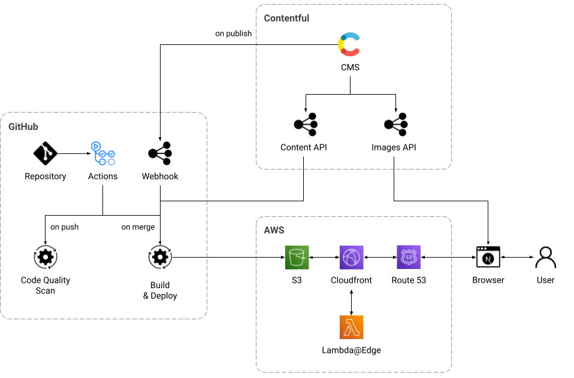

# Patrick's Recipes

- [TL;DR](#tldr)
  - [System Architecture](#system-architecture)
  - [Project Setup](#project-setup)
- [Contentful as Headless CMS](docs/contentful.md)
  - [Code Generation for GraphQL Types](docs/contentful.md#code-generation-for-graphql-types)
  - [Content Definitions](docs/contentful.md#content-definitions)
- [Maximizing Performance](docs/performance.md)
  - [Static Site Generation](docs/performance.md#static-site-generation)
  - [Images](docs/performance.md#images)
  - [Fonts](docs/performance.md#fonts)
  - [Styling](docs/performance.md#styling)
- [Automation](docs/automation.md)
  - [npm Scripts](docs/automation.md#npm-scripts)
  - [Unit Testing](docs/automation.md#unit-testing)
  - [Local Automation Using Husky](docs/automation.md#local-automation-using-husky)
  - [CI/CD Automation Using GitHub Actions](docs/automation.md#cicd-automation-using-github-actions)
- [Manual Scans](docs/manual-scans.md)
  - [Google Lighthouse](docs/manual-scans.md#google-lighthouse)
  - [Checkbot Site Scanner](docs/manual-scans.md#checkbot-site-scanner)
  - [WAVE Evaluation Tool](docs/manual-scans.md#wave-evaluation-tool)
- [Next Steps](docs/next-steps.md)

## TL;DR

This application serves two purposes.

First, it was built so that I could **organize my personal recipes** and get rid of the paper notebooks where I collected the recipes I use. Moving the recipes to a **mobile-friendly, on-line solution** lets me find and use them easily I am cooking at home or somewhere else with friends or family.

Second, it was an ideal project to **validate best practices** for building software applications with a **modern technology stack** and a **lean, iterative process**, testing system design hypotheses as I built out features from the project backlog.

The overall priorities for this project were:

- To create a **mobile-first** application that is designed to be used with a phone or tablet on the kitchen counter while cooking. This means that it is being viewed at a distance that is greater than when the device is held in the hand and the UI needs to account for the greater distance for optimum user experience.

- To build a **high-performing, crawler-friendly** site that is optimized for **SEO** and **accessibility**, eliminating the need to refactor these areas in the future

- To set up an **automated CI/CD pipeline** using headless, API-based services in a serverless environment

The technology stack for this project is:

- <a href="https://nextjs.org/" target="_blank">Next.js</a> with Static Site Generation

- <a href="https://www.contentful.com/" target="_blank">Contentful</a> as a headless CMS to separate the browser client from the back end technology

- <a href="https://www.typescriptlang.org/" target="_blank">Typescript</a>

- <a href="https://jestjs.io/" target="_blank">Jest</a> with <a href="https://testing-library.com/docs/react-testing-library/intro/" target="_blank">React Testing Library</a> for unit tests

- <a href="https://graphql.org/" target="_blank">GraphQL</a> with dynamic type generation using <a href="https://the-guild.dev/graphql/codegen" target="_blank">GraphQL Code Generator</a>

- <a href="https://mui.com/" target="_blank">Material UI</a> with a custom theme

- Serverless deployment on a global content delivery network (CDN) using <a href="https://aws.amazon.com/s3/" target="_blank">AWS S3</a> and <a href="https://aws.amazon.com/cloudfront/" target="_blank">Cloudfront</a> with <a href="https://aws.amazon.com/lambda/edge/" target="_blank">lambda@edge</a> for middleware functions

- <a href="https://docs.github.com/en/actions" target="_blank">GitHub Actions</a> as a CI/CD pipeline for code quality scans, build, and deploy automation

### System Architecture

  

### Project Setup

This is a **Next.js** project bootstrapped with <a href="https://github.com/vercel/next.js/tree/canary/packages/create-next-app" target="_blank">`create-next-app`</a> .

To run the application locally, clone the repository to your local environment and install the required dependencies:

```bash
git clone git@github.com:pliddy-com/recipes-next.git
cd recipes-next
npm install
```

Before executing the application, a local .env file should be created to store environmental variables and secrets:

```bash
# Public url for the deployed site
NEXT_PUBLIC_SITE_URL=https://recipes.pliddy.com

# Contentful api credentials
NEXT_PUBLIC_CONTENTFUL_SPACE_ID={CONTENTFUL_SPACE_ID}
NEXT_PUBLIC_CONTENTFUL_ACCESS_TOKEN={CONTENTFUL_ACCESS_TOKEN}
NEXT_PUBLIC_API_ENDPOINT={API_ENDPOINT}/

# AWS S3 and CloudFront identifiers
DISTRIBUTION_ID={DISTRIBUTION_ID}
S3_BUCKET={S3_BUCKET}

```

Once the local development environment is configured, launch the development server:

```bash
npm run dev
```

Then, open [localhost:3000](http://localhost:3000) in your browser to test the application.

The deployed site can be viewed at <a href="https://recipes.pliddy.com" target="_blank">recipes.pliddy.com</a>.

<!-- <div style="display: flex; justify-content: flex-end;">
    <div >
        <a href="docs/contentful.md">Contentful as Headless CMS</a>&nbsp;>
    </div>
</div> -->

---

<p align="center">
  <strong>TL;DR</strong>&nbsp;&nbsp;|&nbsp;&nbsp;<a href="docs/contentful.md">Contentful as Headless CMS</a>&nbsp;&nbsp;|&nbsp;&nbsp;<a href="performance.md">Maximizing Performance</a>&nbsp;&nbsp;|&nbsp;&nbsp;<a href="automation.md">Automation</a>&nbsp;&nbsp;|&nbsp;&nbsp;<a href="manual-scans.md">Manual Scans</a>&nbsp;&nbsp;|&nbsp;&nbsp;<a href="next-steps.md">Next Steps</a>
</p>
