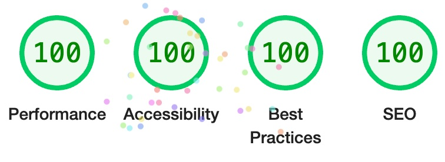

# Patrick's Recipes

This is a tool for collecting and organizing my personal recipes. The UI is optimized for using on a mobile device propped on the kitchen counter where the screen is viewed at a greater distance than when the device is held in the hand.

Using Next.js Static Site Generation to pre-render the site and globally distributing files with AWS S3 and CloudFront as a global CDN.

<p align="center">
  
</p>

The application is optimized for SEO and accessibility. Google Lightouse scores for [recipes.pliddy.com](https://recipes.pliddy.com) for Best Practices, SEO, and Accessibility are 100. Lighthouse Performance scores are regularly in the high 90's, occassionally achieving a perfect 100 if assets are cached on the CDN.

## Features

- Next.js with Static Site Generation
- Typescript
- Material UI with custom theme
- GraphQL with dynamic type generation
- Contentful as Headless CMS
- Serverless Deployment using AWS
  - S3
  - Cloudfront
  - lambda@edge for middleware functions
- CI/CD using GitHub Actions
  - Quality control scans
  - Build and deploy
  - Webhook trigger on scheduled publish

## Project Description

This is a [Next.js](https://nextjs.org/) project bootstrapped with [`create-next-app`](https://github.com/vercel/next.js/tree/canary/packages/create-next-app).

First, run the development server:

```bash
npm run dev
```

Open [http://localhost:3000](http://localhost:3000) with your browser to use the application.

## Automation

### Local Automation using Husky

Using Husky and a pre-commit hook, quality control shell scripts are run before any git commit can be executed, including updated type generation, type checks, linting, and running of the full suite of unit tests.

### CI/CD automation using GitHub Actions

#### Quality Control Scan

The `scan` workflow performs linting, checks Typescript types, and runs unit tests.

`scan` is triggered by pushing a feature branch to GitHub

#### Build and Deploy

The `build` workflow generates the most recent types based on current CMS content models and runs the suite of unit tests, then executes a Next.js build. The artifacts from the build are deployed to the web by syncing with an AWS S3 bucket and invalidating the cloudfront distribution.

`build` is triggered by merging the main branch through an approved pull request. `build` is also triggered when a scheduled publish event occurs in Contentful and it posts a request to a GitHub webhook that triggers the build and deploy workflow.

## Repository

## Package Scripts

## Performance

### Images

Custom image component

- HTML-based markup, no load-time scripting
- No 3rd-party imports
- Responsive sourcesets for multiple image sizes
- Preload tags
- Lazy Loading

### Fonts

- Use variable weight TrueType fonts to reduce number of font files to load for the range of desired weights
- Minimize use of typeface variants, specifically, omitting the use of italic typefaces
- Self-hosting fonts with the application instead of using a 3rd party repository
- Adding preload tags

### Material Theme

- Application styles are defined through a custom Material UI theme, so all styling is handled in-code. Style properties are encoded in the pre-rendered html pages and require no network calls to load external CSS files.

### Standardized templates (prefetch json)

- efficient follow-on page loads once template files are cached by the browser
- prefetching of json files by Next.js

## Headless CMS

Content Definitions

- Recipe
- Tags
- Taxonomy

## GraphQL & Typescript

Queries & Fragments to define types for payloads passed as props to React components

## Unit Testing

Coverage
Mocks
Approach
