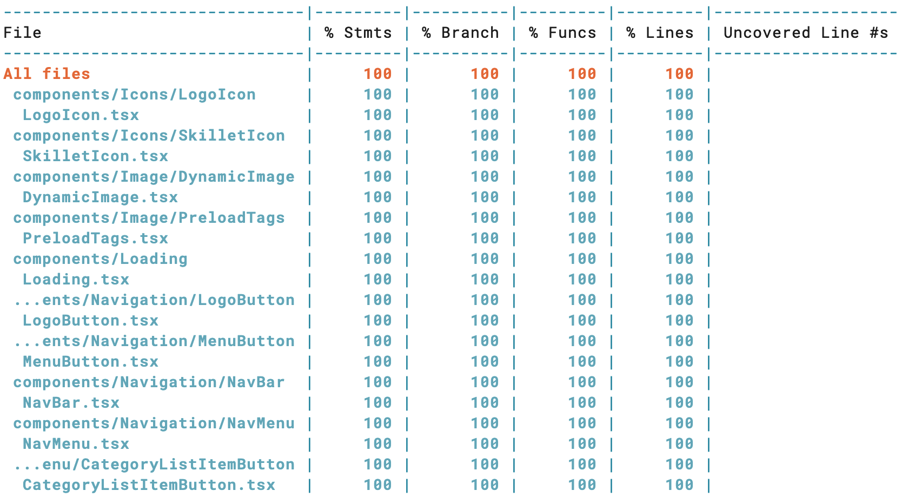
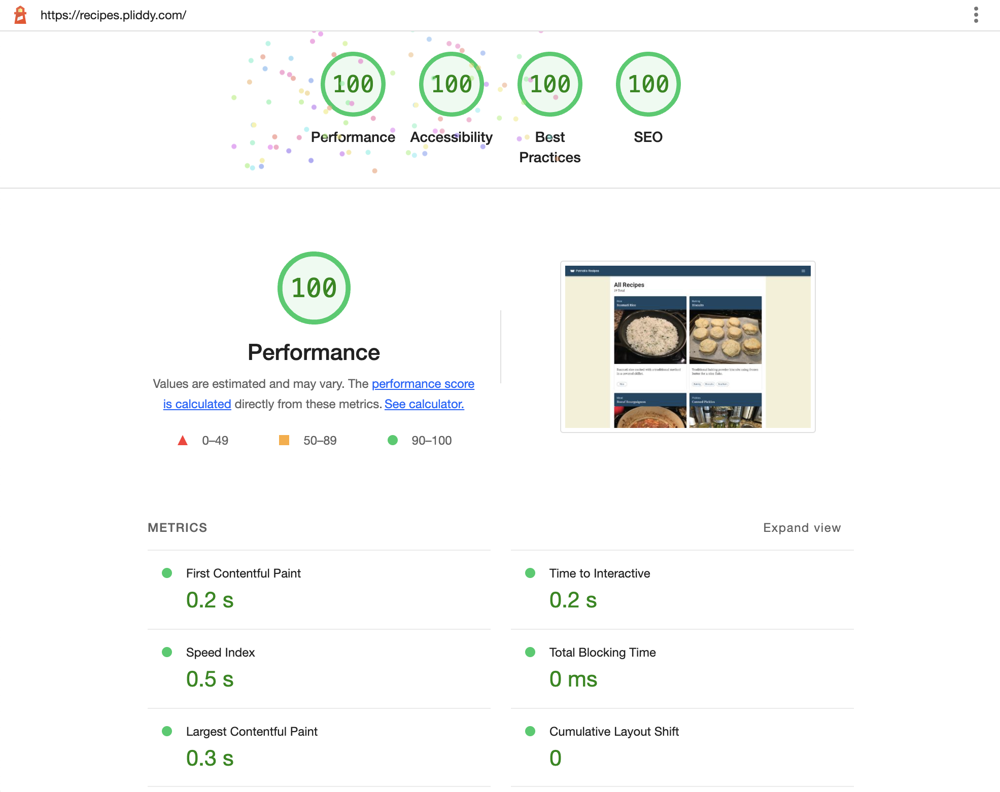
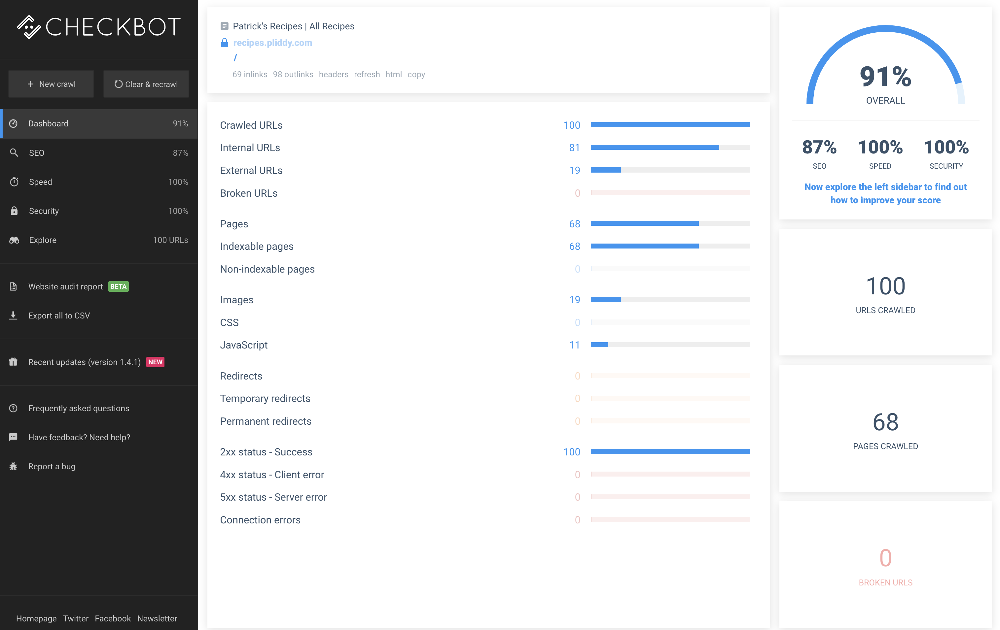
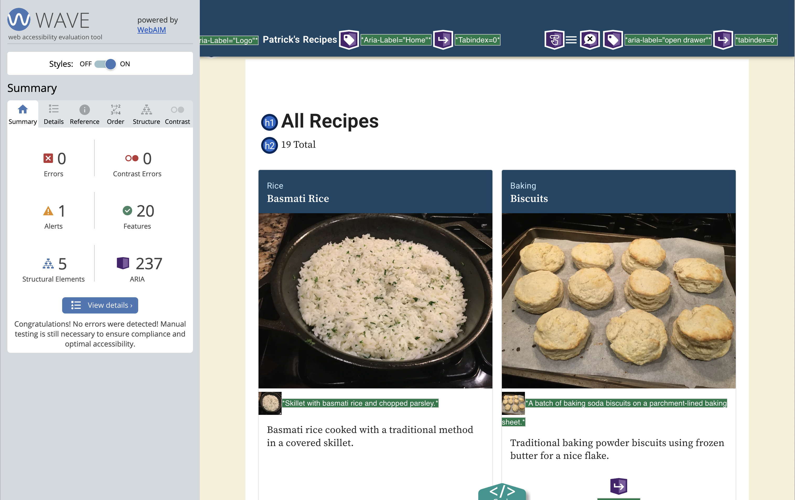

# Patrick's Recipes

This application is a tool for collecting and organizing my personal **collection of recipes.** Originally, these recipes were stored in a variety of digital and off-line formats, including browser bookmarks, digital notes in multiple applications, and old-school paper notebooks.

Just to get them organized, I copied all the content for about 60 recipes into Google Docs using a template for each recipe. Since all the content was being captured in a **consistent, structured format**, it seemed like an ideal opportunity to use a **headless content managment system (CMS)** to store and manage the recipe content.

I built a data-driven React front end for viewing the recipes. The UI is optimized for using on a mobile device placed on a kitchen counter since the screen is viewed at a **greater distance than when the device is traditionally held in the hand**.

The inital React application was manually deployed to an S3 bucket on Amazon Web Services (AWS) for my own personal use. I decided to take the opportunity to leverage a more modern technology stack and software development best practices to build a **high-performing, crawler-friendly** site with an **automated CI/CD pipeline.**

Another goal for the project was to address structural and performance issues in the core platform before scaling in order to **minimize potential future technical debt**.

The project is built using these technologies:

- <a href="https://nextjs.org/" target="_blank">Next.js</a> with Static Site Generation

- <a href="https://www.contentful.com/" target="_blank">Contentful</a> as a Headless CMS

- <a href="https://www.typescriptlang.org/" target="_blank">Typescript</a>

- <a href="https://jestjs.io/" target="_blank">Jest</a> with <a href="https://testing-library.com/docs/react-testing-library/intro/" target="_blank">React Testing Library</a> for unit tests

- <a href="https://graphql.org/" target="_blank">GraphQL</a> with dynamic type generation using <a href="https://the-guild.dev/graphql/codegen" 
  target="_blank">GraphQL Code Generator</a>

- <a href="https://mui.com/" target="_blank">Material UI</a> Material UI with custom theme

- Serverless deployment on a global content delivery network (CDN) using <a href="https://aws.amazon.com/s3/" target="_blank">AWS S3</a> and <a href="https://aws.amazon.com/cloudfront/" target="_blank">Cloudfront</a> with <a href="https://aws.amazon.com/lambda/edge/" target="_blank">lambda@edge</a> for middleware functions

- <a href="https://docs.github.com/en/actions" target="_blank">GitHub Actions</a> as a CI/CD pipeline for
  - **code quality scans** when branches are pushed
  - **build and deploy automation** triggered through merged pull requests or webhooks called when content is published.

## Project Setup

This is a **Next.js** project bootstrapped with <a href="https://github.com/vercel/next.js/tree/canary/packages/create-next-app" target="_blank">`create-next-app`</a> .

To run the application locally, clone the repository to your local environment and install the required dependencies:

```bash
git clone git@github.com:pliddy-com/recipes-next.git
npm install
```

Before executing the application, a local .env file should be created to store environmental variables and secrets:

```bash
# Public url for the deployed site
NEXT_PUBLIC_SITE_URL=https://recipes.pliddy.com

# Contentful api credentials
NEXT_PUBLIC_CONTENTFUL_SPACE_ID={CONTENTFUL_SPACE_ID}
NEXT_PUBLIC_CONTENTFUL_ACCESS_TOKEN={CONTENTFUL_ACCESS_TOKEN}
NEXT_PUBLIC_API_ENDPOINT={API_ENDPOINT}/

# AWS S3 and CloudFront identifiers
DISTRIBUTION_ID={DISTRIBUTION_ID}
S3_BUCKET={S3_BUCKET}

```

Once the local development environment is configured, launch the development server:

```bash
npm run dev
```

Then, open [localhost:3000](http://localhost:3000) in your browser to test the application.

The deployed site can be viewed at <a href="https://recipes.pliddy.com" target="_blank">recipes.pliddy.com</a>.

## System Architecture

[ System Architecture goes here ]

- browser client
  - page template
  - json file
  - js bundles
- AWS environment
  - S3
  - CloudFront
  - Route 53
- GitHub
  - code repository
  - GitHub Actions
- Contentful
  - content API (GraphQL)
  - image API (cached on CDN)

## Headless CMS

Content Definitions

- Recipe
- Tags
- Taxonomy

### GraphQL & Typescript

Queries & Fragments to define types for payloads passed as props to React components

### CodeGen for GraphQL Types

[CodeGen for GraphQL Types description goes here]

## Maximizing Performance

### Static Site Generation

- Standardized templates (prefetch json)
- efficient follow-on page loads once template files are cached by the browser
- prefetching of json files by Next.js
- partial ISG for data, build required for new content
- fast builds (<2 min)

### Images

Custom image component

- HTML-based markup, no load-time scripting
- No 3rd-party imports
- Responsive sourcesets for multiple image sizes
- Preload tags
- Lazy Loading

### Fonts

- Use variable weight TrueType fonts to reduce number of font files to load for the range of desired weights
- Minimize use of typeface variants, specifically, omitting the use of italic typefaces
- Self-hosting fonts with the application instead of using a 3rd party repository
- Adding preload tags

### Material Theme

- Application styles are defined through a custom Material UI theme, so all styling is handled in-code. Style properties are encoded in the pre-rendered html pages and require no network calls to load external CSS files.

## Automation

Automation for this project is based on two technologies, `npm` package scripts and workflows in GitHub Actions.

Package scripts are used locally for code quality checks during the local development process. These scripts are also used as pre-commit hooks by <a href="https://typicode.github.io/husky/#/" target="_blank">Husky</a> to ensure code quality before feature branches are pushed to GitHub for pull requests.

GitHub Actions perform code quality checks on any push of a feature branch to GitHub and to trigger the build and deploy process through merged pull requests or a webhook request when new content is published.

### Package Scripts

There is a collection of `npm` scripts in the `package.json` file that are used for code quality checks, build, and deployment. These are run from the console in local development or as part of the workflow in GitHub actions.

#### Linting Scripts

- `lint` - runs style and formatting checks on the codebase using prettier and eslint
- `lint:fix` - runs linting checks and fixes outstanding issues

#### Unit Test Scripts

- `test` - runs the suite of unit tests
- `test:dev` - runs unit tests in watch mode for development
- `test:snapshot"` - runs unit tests, rebuilding any updated test snapshots
- `test:ci` - runs unit tests in jest cli mode

#### GraphQL Type Generation Scripts

- `typegen` - runs TypeScript codegen based on Contentful content models and GraphQL queries and fragments
- `typegen:watch` - runs type generation in watch mode for development

#### Type Check Script

- `typecheck` - runs type checking

#### Husky Hook Script

- `prepare` - installs packages to prepare Husky for local pre-commit scans

#### Local Development Scripts

- `dev` - launches the local development server
- `predev` - runs `typegen` before launching the development server
- `start` - launches the next server locally
- `prestart` - runs the `build` script before launching the local server

#### Build and Deploy Scripts

- `sitemap` - generates sitemap files for the statically generated site
- `invalidate` - invalidates the CloudFront distribution cache
- `build` - runs a Next.js build
- `prebuild` - runs `typegen` and `test` before the build
- `postbuild` - runs `sitemap` after the current build
- `export` - exports Next.js build files to the `/out` directory
- `preexport` - runs `build` before exporting
- `deploy` - syncs build artifacts in the `out` directory with the S3 bucket that hosts the static site
- `predeploy` - runs `export` before deployment
- `postdeploy` - runs `invalidate` after deployment

### Unit Testing

Unit testing for this application is handles using `jest` and `testing-library` for React. Combining these two packages enables unit testing on TypeScript modules as well as user-centered testing of the React UI in cases where there are specific user actions that result in code execution.

It is possible to get complete code coverage by rendering the React components and handling conditional use cases in the code, but this does not validate the rendered output. The addition of snapshot tests ensures that every time the unit test is run, the output of the component's render function can be tested for consistency without explicitly checking for individual rendered elements in each test.

#### Coverage

The current unit testing suite covers 100% of the codebase with the exception of 4 files. The files that are specifically ignored either do not have callable functions or are boilerplate code generated by `create-next-app` that are excessively complex to mock and are generally not modified.

- `src/pages/_app.tsx` - This is the boilerplate for creating a React generated by `create-next-app`. The page is essentially a collection of nested providers specified by Next.js.
- `src/pages/_document.tsx` - This page is the boilerplate for generating Next.js pages for the application. It is the static wrapper for creating the html documents for each page.
- `lib/gqlClient.ts` - This module exports an `urql` client for making GraphQL API queries. All API functionality is tested in `src/lib/api.ts`. The `createClient()` function in this module requires mocking of a complex 3rd-party client that has a low risk of undetected changes.
- `src/lib/styles.ts` - a collection of utility styles that can be applied to various components but do not fit clearly in the Material UI theme. Since they are static representations of style classes, there is no code to execute in this file

<p align="center">
  
</p>

### Local Automation using Husky

Using Husky and a pre-commit hook, code quality scans are run before any git commit can be executed, including updated **type generation, type checks, linting,** and running the full suite of **unit tests.**

### CI/CD automation using GitHub Actions

#### Code Quality

The GitHub Actions `scan` workflow performs **linting, checks Typescript types,** and **runs unit tests.**

`scan` is triggered by pushing a feature branch to GitHub

#### Build and Deploy

The GitHub Actions `build` workflow generates the most recent types based on current CMS content models and runs the suite of unit tests, then executes a Next.js build. The artifacts from the build are deployed to the web by syncing with an AWS S3 bucket and invalidating the CloudFront distribution.

`build` is triggered by merging the main branch through an approved pull request.

`build` is also triggered when a scheduled publish event occurs in Contentful and it posts a request to a GitHub webhook that triggers the build and deploy workflow.

## Manual Scans

In addition to the automated code quality checks executed as part of the CI/CD pipeline, additional **manual scans** are executed on major deployments to identify any potential issues and resolve them early. This early intervention eliminates potential impacts to performance, security, SEO, and accessibility before they are implemented at scale and become long-running technical debt.

### Google Lighthouse

The application is manually checked for **performance, accessibility, best practices,** and **SEO** using the Lighthouse in the Google Chrome developer tools.

Lightouse scores for **Best Practices, SEO,** and **Accessibility** are 100.

**Performance** scores are regularly in the high 90's, occassionally achieving a perfect 100 if assets are cached on the CDN.

#### Current issues identified by Lighthouse

While performance numbers for desktop is consistently 99-100, the simulation of mobile behavior in Lighthouse can return a performance score in the low 80s. This is mainly attributable to a warning to `Avoid long main-thread tasks` that are part of the static, chunked JavaScript files generated by Next.js.

These issues will be addressed by evaluating the use of Next.js to dynamically load of components to minimize code bundles required for initial page load.

<p align="center">
  
</p>

### Checkbot Site Scanner for SEO, Security, and Performance

In order to get more detailed technical scans for **SEO, security,** and **performance,** the application is scanned with the <a href="https://chrome.google.com/webstore/detail/checkbot-seo-web-speed-se/dagohlmlhagincbfilmkadjgmdnkjinl" target="_blank">Checkbot Site Scanner</a> Chrome Browser extension.

Checkbot identified a variety of potential security issues with the configuration of the static site delivery through AWS CloudFront and S3. Any potential security issues were addressed by proper configuration of response header tags in CloudFront.

#### Current issues identified by Checkbot

The single SEO-related technical issue identified by Checkbot is the lack of a properly re-directing 404 page. This feature is part of the next round of user stories in the backlog.

The remaining issues that impact the application's potential SEO score are related to the relatively thin content currently in the system. There are a limited number of recipes with placeholder content for descriptions and abstracts on core content pages.

These issues will be addressed by updating all current recipe descriptions and abstracts with more robust copy and the creation of additional recipes to make pages that aggregate recipes by tag unique. With the limited number of recipes in the system, there can be multiple tag pages that display the same single recipe. To bots crawling the site, these pages look like duplicate pages.

<p align="center">
  
</p>

### WAVE Evaluation Tool for Accessibility

In order to get more detailed scans for **site accessibility,** the application is scanned with the <a href="https://chrome.google.com/webstore/detail/wave-evaluation-tool/jbbplnpkjmmeebjpijfedlgcdilocofh" target="_blank">WAVE Evaluation Tool</a> Chrome Browser extension.

While Lighthouse identifies major accessibility issues with a page, WAVE conducts a more detailed scans and identifies specific implementation details which can affect a page's accessibility, including color contrast and aria labels.

#### Current issues identified by WAVE

The only outstanding warning from WAVE is the existence of a `<noscript>` tag on the page, which is inserted by Next.js as part of the build process.

<p align="center">
  
</p>

## Next Steps

This README file documents the thinking behind the project and its architecture and describes the current state of the project.

There is currently a backlog of approximately 25 stories identifying new features, enhancements to existing features, or technical efficiencies. The prioritized backlog items for next steps include:

- Adding a 404 page and correct routing functionality for unknown urls
- Enhancing the existing content for improved SEO performance identified by the Checkbot scans
- Adding recipe schemas from schema.org to page headers in order to enable display of Google search results as rich snippets
- Implementing lazy loading of Next.js components to improve initial page load performance on mobile devices
- Creating infrastructure-as-code deployment scripts using the <a href="https://docs.aws.amazon.com/cdk/v2/guide/home.html" target="_blank">AWS Cloud Development Kit (CDK)</a> to enable just-in-time creation of feature branch environments for testing
- Implementing Algolia for site search
- Adding additional content types to Contentful for articles and featured landing pages that aggregate content of multiple types
- Enabling creation and editing of recipe content through the UI by leveraging GraphQL transforms and the Contentful content API
