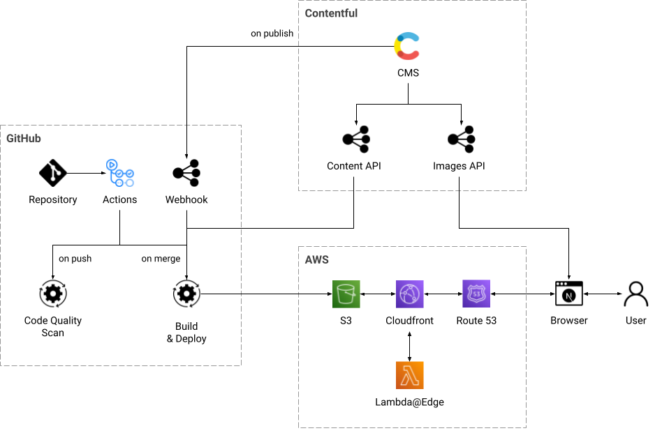
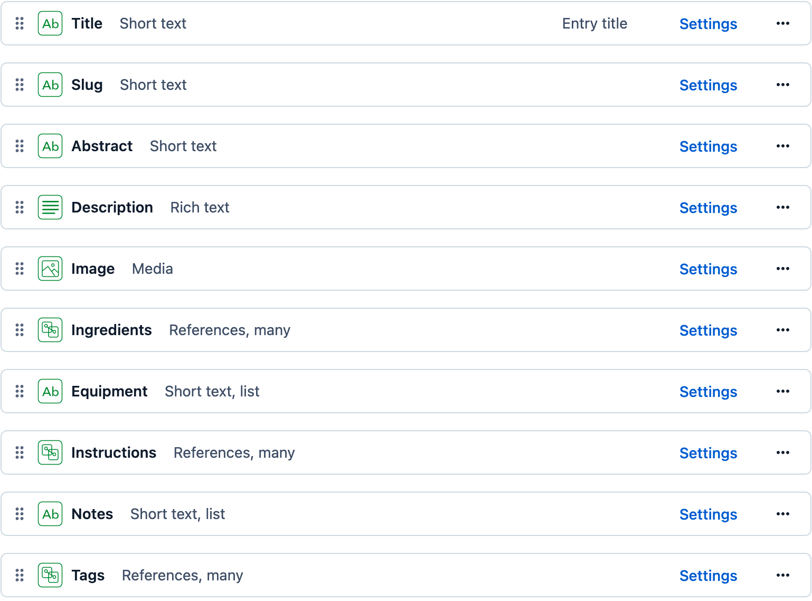
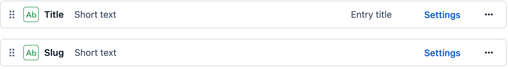
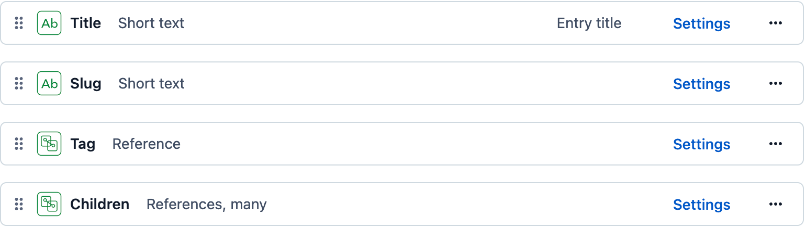

# Patrick's Recipes

- [TL;DR](#tldr)
- [System Architecture](#system-architecture)
- [Project Setup](#project-setup)
- [Contentful as Headless CMS](#contentful-as-headless-cms)
  - [Content Definitions](#content-definitions)
  - [Code Generation for GraphQL Types](#code-generation-for-graphql-types)
- [Maximizing Performance](#maximizing-performance)
  - [Static Site Generation](#static-site-generation)
  - [Images](#images)
  - [Fonts](#fonts)
  - [Styling](#styling)
- [Automation](#automation)
  - [npm Scripts](#npm-scripts)
  - [Unit Testing](#unit-testing)
  - [Local Automation Using Husky](#local-automation-using-husky)
  - [CI/CD Automation Using GitHub Actions](#cicd-automation-using-github-actions)
- [Manual Scans](#manual-scans)
  - [Google Lighthouse](#google-lighthouse)
  - [Checkbot Site Scanner](#checkbot-site-scanner)
  - [WAVE Evaluation Tool](#wave-evaluation-tool)
- [Next Steps](#next-steps)

## TL;DR

This application serves two purposes.

First, it was built so that I could **organize my personal recipes** and get rid of the paper notebooks where I collected the recipes I use. Moving the recipes to a **mobile-friendly, on-line solution** lets me find and use them easily I am cooking at home or somewhere else with friends or family.

Second, it was an ideal project to **validate best practices** for building software applications with a **modern technology stack** and a **lean, iterative process**, testing system design hypotheses as I built out features from the project backlog.

The overall priorities for this project were:

- To create a **mobile-first** application that is designed to be used with a phone or tablet on the kitchen counter while cooking. This means that it is being viewed at a distance that is greater than when the device is held in the hand and the UI needs to account for the greater distance for optimum user experience.

- To build a **high-performing, crawler-friendly** site that is optimized for **SEO** and **accessibility**, eliminating the need to refactor these areas in the future

- To set up an **automated CI/CD pipeline** using headless, API-based services in a serverless environment

The technology stack for this project is:

- <a href="https://nextjs.org/" target="_blank">Next.js</a> with Static Site Generation

- <a href="https://www.contentful.com/" target="_blank">Contentful</a> as a headless CMS to separate the browser client from the back end technology

- <a href="https://www.typescriptlang.org/" target="_blank">Typescript</a>

- <a href="https://jestjs.io/" target="_blank">Jest</a> with <a href="https://testing-library.com/docs/react-testing-library/intro/" target="_blank">React Testing Library</a> for unit tests

- <a href="https://graphql.org/" target="_blank">GraphQL</a> with dynamic type generation using <a href="https://the-guild.dev/graphql/codegen" target="_blank">GraphQL Code Generator</a>

- <a href="https://mui.com/" target="_blank">Material UI</a> with a custom theme

- Serverless deployment on a global content delivery network (CDN) using <a href="https://aws.amazon.com/s3/" target="_blank">AWS S3</a> and <a href="https://aws.amazon.com/cloudfront/" target="_blank">Cloudfront</a> with <a href="https://aws.amazon.com/lambda/edge/" target="_blank">lambda@edge</a> for middleware functions

- <a href="https://docs.github.com/en/actions" target="_blank">GitHub Actions</a> as a CI/CD pipeline for code quality scans, build, and deploy automation

<p align="right">[ <a href="#readme">back to top</a> ]</p>

## System Architecture

  

<p align="right">[ <a href="#readme">back to top</a> ]</p>

## Project Setup

This is a **Next.js** project bootstrapped with <a href="https://github.com/vercel/next.js/tree/canary/packages/create-next-app" target="_blank">`create-next-app`</a> .

To run the application locally, clone the repository to your local environment and install the required dependencies:

```bash
git clone git@github.com:pliddy-com/recipes-next.git
cd recipes-next
npm install
```

Before executing the application, a local .env file should be created to store environmental variables and secrets:

```bash
# Public url for the deployed site
NEXT_PUBLIC_SITE_URL=https://recipes.pliddy.com

# Contentful api credentials
NEXT_PUBLIC_CONTENTFUL_SPACE_ID={CONTENTFUL_SPACE_ID}
NEXT_PUBLIC_CONTENTFUL_ACCESS_TOKEN={CONTENTFUL_ACCESS_TOKEN}
NEXT_PUBLIC_API_ENDPOINT={API_ENDPOINT}/

# AWS S3 and CloudFront identifiers
DISTRIBUTION_ID={DISTRIBUTION_ID}
S3_BUCKET={S3_BUCKET}

```

Once the local development environment is configured, launch the development server:

```bash
npm run dev
```

Then, open [localhost:3000](http://localhost:3000) in your browser to test the application.

The deployed site can be viewed at <a href="https://recipes.pliddy.com" target="_blank">recipes.pliddy.com</a>.

<p align="right">[ <a href="#readme">back to top</a> ]</p>

## Contentful as Headless CMS

This application uses Contentful as its headless content management system. Contentful provides two APIs that are used in the prjoect:

- The **content API** provides a GraphQL endpoint for content queries. This api is also used to retrieve content models from the CMS for code generation of TypeScript types used in the client-side codebase.

- The **images API** provides a REST endpoint for retrieving image assets by the client application. This api can also apply transformations to the image assets through url parameters. Requests for images are cached for individual image sizes and formats, reducing calls to the origin server and improving overall client performance.

### Content Definitions

There are two key content types in the system:

- `Recipe` - This is the primary content type that defines the page-level content for the application. A Recipe entry contains all data and metadata that is required to render a full page of Recipe content. Client side queries can also retrieve summary versions of a Recipe entry for display in the card format.

  

- `Tag` - Tags are simply labels applied to content that are used to organize and query for collections of content. All queries and grouping of content on the client are organized around tags.

  

Additionally, there is one other content type in the system:

- `Taxonomy` - A Taxonomy is a collection of tags. The Taxonomy is used to generate custom grouped collections of Recipe content. A Taxonomy can also be used as the child of a parent taxonomy to define sub-groups within the parent taxonomy.

  

In this application, for example, the primary navigation menu is built from a Taxonomy called `Categories`. Categories are a list of editorially selected tags that are shown in the navigation menu and also generate Category pages containing all Recipes that are assigned the category tag. Child taxonomies are used to create subcategories under category tags.

Since the only difference between a category and a tag page is that certain tags have been editorially selected to appear in the navigation, the application renders the page as a "tag" page.

Next.js routing is configured to rewrite requests to a `/category/*` url to the identical `/tag/*` page with appropriate canonical page tags.

### Code Generation for GraphQL Types

In order to define the TypeScript types for content payloads returned by GraphQL queries to Contentful, the application uses <a href="https://the-guild.dev/graphql/codegen" target="_blank">GraphQL Code Generator</a>.

Defintions for entire payloads are defined by named GraphQL queries in the code, while sections of the payload that are passed as properties to individual React components are defined by GraphQL fragments referenced by the queries.

<p align="right">[ <a href="#readme">back to top</a> ]</p>

## Maximizing Performance

A high level of overall site performance was a primary objective for this project. This has been achieved through iteration of various features during the development process.

The largest impact to performance has been a result of the use of static site generation and minimizing the number and size of requests for external image, font, and `css` resources.

### Static Site Generation

This application uses the **Static Site Generation (SSG)** feature of Next.js. For each url in the application, the build process creates an html document (≈12.5 kB), a `json` file containing the content payload (≈10 kB), and an assortment of JavaScript bundles (≈500 kB).

This build generates a page for each recipe in the site, as well as a pre-rendered page for each recipe collection identified by a given tag. The result is a static site with efficient initial page loads, minimum JavaScript execution, and rapid in-site navigation once resources are loaded on the initial page view.

Additionally, Next.js uses **lazy pre-fetching** of `json` data files for linked pages. Navigating to a page type that has previously been viewed is almost instantaneous since all resources except for images are cached by the browser.

Pages also utilize the Next `revalidate` feature, which means when a current page renders, it uses the content API to check if its content has been updated in the CMS. If the content has changed, the page will fetch a new `json` payload with the latest content without requiring a full site rebuild.

If a new page is published, the site will require a full rebuild in order to know about the new page url. Building and deploying individual statically-generated pages would requrie some type of server to handle the request. If this feature is identified as a priority, it could potentially be handled through GitHub Actions or a standalone AWS Lambda function.

Since the build and deploy process only takes **90-120 seconds** from start to availability across the AWS CloudFront CDN, the project can be statically generated **hundreds of times a month** within the free-tier limits of GitHub Actions and AWS.

### Images

While static site generation can optimize html templates, content, and script bundles, images are, usually, the largest contributor to page loading. To eliminate issues with performance and accessibility, I created a [`DynamicImage`](src/components/Image/DynamicImage/) component to effectively handle responsive images.

Instead of relying on a 3rd-party higher order component to manage image loading behind the scenes, the `DynamicImage` component renders standard `html` tags for the body and head elements of the page. The use of `html` tags instead of runtime JavaScript means that the optimum image can be identified and loaded by the browser before any in-page scripts are executed.

`DynamicImage` creates a `<picture />` element with multiple `<source />` tags and `srcSet` properties to handle all desired responsive behaviors. It also utilizes Next.js's `<Head />` component to optionally inject `preload` tags into the header of any page that uses the Dynamic Image component. Any images that are not preloaded can be delegated to be lazy loaded by the browser when the user scrolls down the page.

The `DynamicImage` component can be used in place of an html `img` tag or in any Material UI component that accepts an image property. Since images can have a variety of sizes and responsive behaviors in the application, the `DynamicImage` is a generic solution. The specifications for proper image width at any given size are provided by a `[componentname].config.tsx` file stored in the same directory as the component that uses `DynamicImage`.

This example configuration file for the [`RecipeCard`](src/components/RecipeCard/) component provides a series of minimum viewport widths and corresponding image widths. The widths used have been standardized at 150px increments to minimize the number of cached, pre-rendered versions of the image stored on Contentful's image API CDN.

```javascript
breakpoints: [
  {
    viewMin: 669,
    imgWidth: 450,
  },

  {
    viewMin: 600,
    imgWidth: 300,
  },
  {
    viewMin: 485,
    imgWidth: 600,
  },
  {
    viewMin: 335,
    imgWidth: 450,
  },
  {
    imgWidth: 300,
  },
];
```

### Fonts

Fonts are another resource that can have significant impact on page performance and metrics like Web Vitals. Having both serif and sans-serif font families with bold and italic options can provide an endless number of design options. The price for this flexibility is loading 4 separate typefaces for each font family. Since font files can be up to 500 kB each, just loading the mentioned can mean 8 requests with 2MB of payload.

To address the font performance issues in this application, several decisions were made:

- **Variable weight** TrueType fonts were selected. Instead of a traditional format with one font file for each weight, variable weight fonts have one file that can render multiple font weights, from thin to extra bold. This capability reduces both the number of requests and payload size for font loading. In this application, serif and sans-serif variable fonts were chosen, providing several weights for both font families with just 542 kB of font resources.

- **Italic font variants** were eliminated from the design system. Since there was no overwhelming use case for the use of italics, there is no need to request an additional font file with its additional performance impact.

- Fonts are **self-hosted** as part of the application deployment on the CDN. This enables font files to be delivered with the same performance level as the rest of the static site files instead of relying on the availability of a 3rd-party font hosting service.

- **Preload** tags for font files are injected into the `<html />` document's `<head />` section so typefaces are available when styles are applied during page rendering without having to wait for a blocked resource to load.

### Styling

Using **Material UI** as a component library provides a wide assortment of pre-configured UI components and reduces the need to develop basic display and interactive components from scratch. In order to create a unique look and feel, these components need to have some level of custom styling.

This application uses a Material UI **custom theme** to define styling. This approach allows the definition of all styles in TypeScript source files as part of the functional code base, as opposed to creating a set of separate `css` resources.

The benefit of using a Material UI theme is that the required styling for a statically generated page is embedded in the html markup, instead of requiring one or more network requests to external CSS resources.

<p align="right">[ <a href="#readme">back to top</a> ]</p>

## Automation

Automation for this project is based on two technologies, npm scripts and workflows in GitHub Actions.

Package scripts are used locally for code quality checks during the local development process. These scripts are also used as pre-commit hooks by <a href="https://typicode.github.io/husky/#/" target="_blank">Husky</a> to ensure code quality before feature branches are pushed to GitHub for pull requests.

GitHub Actions perform code quality checks on any push of a feature branch to GitHub and to trigger the build and deploy process through merged pull requests or a webhook request when new content is published.

### npm Scripts

There is a collection of npm scripts in the `package.json` file that are used for code quality checks, build, and deployment. These are run from the console in local development or as part of the workflow in GitHub actions.

#### Linting Scripts

- `lint` - runs style and formatting checks on the codebase using prettier and eslint
- `lint:fix` - runs linting checks and fixes outstanding issues

#### Unit Test Scripts

- `test` - runs the suite of unit tests
- `test:dev` - runs unit tests in watch mode for development
- `test:snapshot"` - runs unit tests, rebuilding any updated test snapshots
- `test:ci` - runs unit tests in jest cli mode

#### GraphQL Type Generation Scripts

- `typegen` - runs TypeScript codegen based on Contentful content models and GraphQL queries and fragments
- `typegen:watch` - runs type generation in watch mode for development

#### Type Check Script

- `typecheck` - runs type checking

#### Husky Hook Script

- `prepare` - installs packages to prepare Husky for local pre-commit scans

#### Local Development Scripts

- `dev` - launches the local development server
- `predev` - runs `typegen` before launching the development server
- `start` - launches the next server locally
- `prestart` - runs the `build` script before launching the local server

#### Build and Deploy Scripts

- `sitemap` - generates sitemap files for the statically generated site
- `invalidate` - invalidates the CloudFront distribution cache
- `build` - runs a Next.js build
- `prebuild` - runs `typegen` and `test` before the build
- `postbuild` - runs `sitemap` after the current build
- `export` - exports Next.js build files to the `/out` directory
- `preexport` - runs `build` before exporting
- `deploy` - syncs build artifacts in the `out` directory with the S3 bucket that hosts the static site
- `predeploy` - runs `export` before deployment
- `postdeploy` - runs `invalidate` after deployment

### Unit Testing

Unit testing for this application uses `jest` and `testing-library` for React. Combining these two packages enables unit testing on TypeScript modules as well as user-centered testing of the React UI in cases where there are specific user actions that result in code execution.

It is possible to get complete code coverage by rendering the React components and handling conditional use cases in the code, but this does not validate the rendered output. The addition of **snapshot tests** ensures that every time the unit test is run, the output of the component's render function can be tested for consistency without explicitly checking for individual rendered elements in each test.

#### Coverage

The current unit testing suite covers 100% of the codebase with the exception of 4 files. The files that are specifically ignored either do not have callable functions or are boilerplate code generated by `create-next-app` that are excessively complex to mock and are generally not modified.

- `src/pages/_app.tsx` - This is the boilerplate for creating a React generated by `create-next-app`. The page is essentially a collection of nested providers specified by Next.js.

- `src/pages/_document.tsx` - This page is the boilerplate for generating Next.js pages for the application. It is the static wrapper for creating the html documents for each page.

- `lib/gqlClient.ts` - This module exports an `urql` client for making GraphQL API queries. All API functionality is tested in `src/lib/api.ts`. The `createClient()` function in this module requires mocking of a complex 3rd-party client that has a low risk of undetected changes.

- `src/lib/styles.ts` - a collection of utility styles that can be applied to various components but do not fit clearly in the Material UI theme. Since they are static representations of style classes, there is no code to execute in this file

<p align="center">
  
</p>

### Local Automation using Husky

Using Husky and a `pre-commit` hook, code quality scans are run before any git commit can be executed, including **type generation, type checks, linting,** and **unit tests.**

### CI/CD automation using GitHub Actions

#### Code Quality

The GitHub Actions `scan` workflow performs **linting, checks Typescript types,** and **runs unit tests.**

`scan` is triggered by pushing a feature branch to GitHub

#### Build and Deploy

The GitHub Actions `build` workflow generates the most recent types based on current content models and runs unit tests, then executes a Next.js build. The artifacts from the build are deployed to the web by syncing with an AWS S3 bucket and invalidating the CloudFront distribution.

`build` is triggered by merging the main branch through an approved pull request.

`build` is also triggered when a scheduled publish event occurs in Contentful and it posts a request to a GitHub webhook that triggers the build and deploy workflow.

<p align="right">[ <a href="#readme">back to top</a> ]</p>

## Manual Scans

In addition to the automated code quality checks in the CI/CD pipeline, **manual scans** are executed on major deployments to identify any issues and resolve them early. This early intervention eliminates potential impacts to performance, security, SEO, and accessibility before they are implemented at scale and become long-running technical debt.

### Google Lighthouse

The application is manually checked for **performance, accessibility, best practices,** and **SEO** using the Lighthouse in the Google Chrome developer tools.

Lightouse scores for **Best Practices, SEO,** and **Accessibility** are 100.

**Performance** scores are regularly in the high 90's, often achieving a perfect 100 if assets are cached on the CDN.

<p align="center">
  
</p>

### Checkbot Site Scanner

In order to get more detailed technical scans for **SEO, security,** and **performance,** the application is scanned with the <a href="https://chrome.google.com/webstore/detail/checkbot-seo-web-speed-se/dagohlmlhagincbfilmkadjgmdnkjinl" target="_blank">Checkbot Site Scanner</a> Chrome Browser extension.

Checkbot identified a variety of potential security issues with the configuration of the static site delivery through AWS CloudFront and S3. Any potential security issues were addressed by proper configuration of response header tags in CloudFront.

#### Current issues identified by Checkbot

The single SEO-related technical issue identified by Checkbot is the lack of a properly re-directing 404 page. This feature is part of the next round of user stories in the backlog.

The remaining issues that impact the application's potential SEO score are related to the relatively thin content currently in the system. There are a limited number of recipes with placeholder content for descriptions and abstracts on core content pages.

These issues will be addressed by updating all current recipe descriptions and abstracts with more robust copy and the creation of additional recipes to ensure that pages that display collections of recipes by tag are unique. With the limited number of recipes currently in the system, there can be multiple tag pages that display the same single recipe. To bots crawling the site, these pages have duplicate content.

<p align="center">
  
</p>

### WAVE Evaluation Tool

In order to get more detailed information regarding **site accessibility,** the application is scanned with the <a href="https://chrome.google.com/webstore/detail/wave-evaluation-tool/jbbplnpkjmmeebjpijfedlgcdilocofh" target="_blank">WAVE Evaluation Tool</a> Chrome Browser extension.

While Lighthouse identifies major accessibility issues with a page, WAVE conducts a more detailed scans and identifies specific WCAG issues which can affect a page's accessibility.

#### Current issues identified by WAVE

The only outstanding warning from WAVE is the existence of a `<noscript>` tag on the page, which is inserted by Next.js as part of the build process.

<p align="center">
  
</p>

<p align="right">[ <a href="#readme">back to top</a> ]</p>

## Next Steps

There is currently a project backlog of approximately 25 stories identifying new features, enhancements to existing features, or technical improvements. The prioritized backlog items for next steps include:

- Adding routing functionality for unknown urls to a 404 page

- Enhancing the existing content for improved SEO performance identified by the Checkbot scans

- Adding recipe schemas from <a href="https://schema.org/Recipe" target="_blank">schema.org</a> to the page head in order to enable display of Google search results as rich snippets

- Implementing lazy loading of Next.js components to improve initial page load performance on mobile devices

- Creating infrastructure-as-code deployment scripts using the <a href="https://docs.aws.amazon.com/cdk/v2/guide/home.html" target="_blank">AWS Cloud Development Kit (CDK)</a> to enable just-in-time creation of identical feature branch environments for testing

- Implementing Algolia for site search

- Adding additional content types to Contentful for articles and featured landing pages that aggregate content of multiple types

- Enabling creation and editing of recipe content through the UI by leveraging GraphQL transforms and the Contentful content API

<p align="right">[ <a href="#readme">back to top</a> ]</p>
