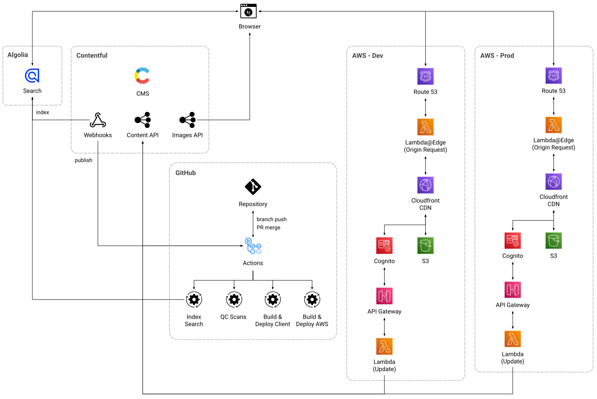

# Patrick's Recipes

- [TL;DR](#tldr)
  - [System Architecture](#system-architecture)
  - [Monorepo Structure](#monorepo-structure)
- [Contentful as Headless CMS](docs/contentful.md)
  - [Code Generation for GraphQL Types](docs/contentful.md#code-generation-for-graphql-types)
  - [Content Definitions](docs/contentful.md#content-definitions)
  - [Page Head Tags](docs/contentful.md#page-head-tags)
  - [AI-generated Placeholder Content](docs/contentful.md#ai-generated-placeholder-content)
- [Maximizing Performance](docs/performance.md)
  - [Static Site Generation](docs/performance.md#static-site-generation)
  - [Dynamic Imports](docs/performance.md#dynamic-imports)
  - [Images](docs/performance.md#images)
  - [Fonts](docs/performance.md#fonts)
  - [Styling](docs/performance.md#styling)
- [Automation](docs/automation.md)
  - [npm Scripts](docs/automation.md#npm-scripts)
  - [Unit Testing](docs/automation.md#unit-testing)
  - [Local Automation Using Husky](docs/automation.md#local-automation-using-husky)
  - [CI/CD Automation Using GitHub Actions](docs/automation.md#cicd-automation-using-github-actions)
- [Manual Scans](docs/manual-scans.md)
  - [Google Lighthouse](docs/manual-scans.md#google-lighthouse)
  - [Checkbot Site Scanner](docs/manual-scans.md#checkbot-site-scanner)
  - [WAVE Evaluation Tool](docs/manual-scans.md#wave-evaluation-tool)
  - [Google Rich Results Test](docs/manual-scans.md#google-rich-results-test)
- [Next Steps](docs/next-steps.md)

## TL;DR

This project has two primary goals.

First, to solve a user need, it was built so that I could **organize my personal recipes** and get consolidate all the notebooks and various digital sources where the recipes I use were saved. Moving the recipes to a **mobile-friendly, on-line solution** lets me find and use them easily when I am cooking at home or somewhere else with friends or family.

Second, it was an ideal project to **demonstrate best practices** for building software applications with an **API-driven architecture,** a **modern technology stack,** and a **lean, iterative process**, testing system design hypotheses as I built out features from the project backlog.

The overall priorities for this project were:

- To design and build a **content delivery platform** using structured content and best practices for modern software architecture with built-in quality and performance.

- To create a **mobile-first** application that is designed to be used with a phone or tablet on the kitchen counter while cooking. This means that it is being viewed at a distance that is greater than when the device is held in the hand and the UI needs to account for the greater distance for optimum user experience.

- To build a **high-performing, crawler-friendly** site that is optimized for **SEO** and **accessibility**, eliminating the need to refactor these areas in the future

- To leverage **headless, API-based services** and **infrastructure as code (IAC)** to create an **automated CI/CD pipeline** that ensures code quality across identical environments for development, testing, and production releases.

The technology stack for this project is built using:

- <a href="https://nextjs.org/" target="_blank"><strong>Next.js</strong></a> with Static Site Generation (SSG)

- <a href="https://www.contentful.com/" target="_blank"><strong>Contentful</strong></a> as a headless CMS to separate the browser client from the back end technology

- <a href="https://www.typescriptlang.org/" target="_blank"><strong>Typescript</strong></a> for type definition

- <a href="https://jestjs.io/" target="_blank"><strong>Jest</strong></a> with <a href="https://testing-library.com/docs/react-testing-library/intro/" target="_blank">React Testing Library</a> for unit tests

- <a href="https://graphql.org/" target="_blank"><strong>GraphQL</strong></a> with dynamic type generation using <a href="https://the-guild.dev/graphql/codegen" target="_blank">GraphQL Code Generator</a>

- <a href="https://mui.com/" target="_blank"><strong>Material UI</strong></a> with a custom theme

- <a href="https://aws.amazon.com/cdk/" target="_blank"><strong>AWS Cloud Development Kit (CDK)</strong></a> for serverless deployment of identical environments on a global content delivery network (CDN) using <a href="https://aws.amazon.com/s3/" target="_blank">AWS S3</a> and <a href="https://aws.amazon.com/cloudfront/" target="_blank">Cloudfront</a> with <a href="https://aws.amazon.com/lambda/edge/" target="_blank">lambda@edge</a> for middleware functions

- <a href="https://docs.github.com/en/actions" target="_blank"><strong>GitHub Actions</strong></a> as a CI/CD pipeline for code quality scans, build processes, and deployment automation

- <a href="https://openai.com/blog/chatgpt" target="\_blank"><strong>ChatGPT</strong></a> for generation of realistic placeholder content for testing SEO performance.

### System Architecture

<p align="center">
  
</p>

### Monorepo Structure

This repository is set up as monorepo using two <a href="https://docs.npmjs.com/cli/v9/using-npm/workspaces" target="_blank">npm workspaces</a>. Each workspace has its own package.json file for defining workspace-specific dependencies and npm scripts. Required environment variables are stored in a local `.env` file in each project. Additionally, there are configuration files at the root level of each workspace for framework-specific Typescript, linting, and unit testing.

- The `client` workspace contains the project for the browser client application. In addition to the application source code, this project contains the package dependencies, npm scripts, and configuration for a statically generated Next.js app using GraphQL.

- The `cdk` workspace contains the project for generating and deploying infrastructure as code using the <a href="https://aws.amazon.com/cdk/" target="_blank">AWS Cloud Development Kit (CDK).</a>

There is an additional `.github` directory at the root level of the repository that contains a `/workflows` with individual `.yml` files that define all the workflows used for CI/CD jobs in Github Actions.

#### Monorepo Directories

```
recipes-next
 |
 |_ .github            # directory for github-specific resources
 |   |
 |   |_ workflows      # contains .yml files defining Github Actions workflows
 |
 |_ cdk                # npm workspace defining the AWS CDK project for IAC
 |   |
 |   |_ bin            # AWS CDK application for deploying resource stacks
 |   |_ lib            # definition of AWS resource stacks (shared and branch-specific)
 |   |_ test           # unit tests for stack definitions and
 |   |_ .env           # local environment variables used by the AWS CDK app
 |   |_ package.json   # definition of the 'cdk' workspace, including npm scripts & dependencies
 |
 |_ client             # npm workspace defining the NextJS SSG project for the browser client
 |   |
 |   |_ mocks          # mocks for 3rd party modules used in unit testing
 |   |_ src            # source code for the NextJS SSG app
 |   |_ public         # static files served with the app (favicons, fonts, etc.)
 |   |_ .env           # local environment variables used by the NextJs app
 |   |_ package.json   # definition of the 'cdk' workspace, including npm scripts & dependencies
 |
 |_ package-lock.json  # lock file for shared package dependencies
 |_ package.json       # repository-level definition of the project, including shared dependencies and npm scripts that execute on all workspaces
```

#### Client Workspace

The client for the system is a **Next.js** project bootstrapped with <a href="https://github.com/vercel/next.js/tree/canary/packages/create-next-app" target="_blank">`create-next-app`</a>.

To run the application locally, clone the repository to your local environment and install the required dependencies:

```bash
git clone git@github.com:pliddy-com/recipes-next.git
cd recipes-next
npm install
```

Before running the application, a local `.env` file should be created at the root level of the `client` workspace to store environmental variables and secrets:

```bash
# Public url for the deployed site
NEXT_PUBLIC_SITE_URL=https://recipes.pliddy.com

# Contentful api credentials
NEXT_PUBLIC_CONTENTFUL_SPACE_ID={CONTENTFUL_SPACE_ID}
NEXT_PUBLIC_CONTENTFUL_ACCESS_TOKEN={CONTENTFUL_ACCESS_TOKEN}
NEXT_PUBLIC_API_ENDPOINT={API_ENDPOINT}

# AWS S3 and CloudFront identifiers
DISTRIBUTION_ID={DISTRIBUTION_ID}
S3_BUCKET={S3_BUCKET_NAME}
```

Once the local development environment is configured, launch the development server:

```bash
npm run dev
```

Then, open [localhost:3000](http://localhost:3000) in your browser to test the application.

The deployed site can be viewed in the production enviroment at <a href="https://recipes.pliddy.com" target="_blank">recipes.pliddy.com</a>.

#### CDK Workspace

The `cdk` workspace is and AWS CDK project that uses infrastructure as code (IAC) to define a set of AWS resources to host the statically-generated Next.js app.

##### AWS Resource Stacks

There are two CloudFormation stacks defined by the `cdk` application that are deployed for feature branch (`dev`) and production (`prod`) environments.

- `RecipesSharedStack` - Creates a single set of AWS resources used by all branches in an environment. These include an S3 bucket for hosting the static files in a branch-specific directory, a Cloudfront Origin Access Identity, a Response Headers Policy, and security certificate for all `*.recipes.pliddy.com` subdomains.

- `RecipesBranchStack` - Creates a set of AWS resources used by a specific branch. Each branch has its own CloudFront distribution with an Origin Request Handler for routing web traffic to the correct static file and a DNS record for `{branch_name}.recipes.pliddy.com` pointing to the CloudFront distribution. All feature branches share the same shared stack for the `dev` environment, while the `main` branch is the only branch stack that uses the shared stack in the `prod` environment.

For local development, an `.env` file should be created at the root level of the `client` workspace to store environmental variables and secrets:

```bash
CDK_DEFAULT_ACCOUNT={AWS_ACCOUNT_ID}
CDK_DEFAULT_REGION={AWS_DEFAULT_REGION}
S3_BUCKET_BASE={S3_BUCKET_NAME_BASE}
```

There is no local instance of the `cdk` workspace, but there is full unit test coverage for the CDK application, as well as linting and typechecking. These can be run from the terminal in the local development environment:

```bash
npm run typecheck -w cdk    # runs a typecheck on the cdk workspace
npm run lint -w cdk         # runs linting on the cdk workspace
npm run test -w cdk         # runs jest unit tests on the cdk workspace

npm run scan:local -w cdk   # runs typecheck, lint, and unit testing on the cdk workspace
```

The npm `scan` script is being called using the `scan:local` variant to handle using `dotenv` to load environment variables into the npm scripts. The non-local variant, `scan`, is used in with GitHub Actions where values are retrieved from the GitHub repository's global secrets store.

---

<p align="center">
  <strong>TL;DR</strong>&nbsp;&nbsp;|&nbsp;&nbsp;
  <a href="docs/contentful.md">Contentful as Headless CMS</a>&nbsp;&nbsp;|&nbsp;&nbsp;
  <a href="docs/performance.md">Maximizing Performance</a>&nbsp;&nbsp;|&nbsp;&nbsp;
  <a href="docs/automation.md">Automation</a>&nbsp;&nbsp;|&nbsp;&nbsp;
  <a href="docs/manual-scans.md">Manual Scans</a>&nbsp;&nbsp;|&nbsp;&nbsp;
  <a href="docs/next-steps.md">Next Steps</a>
</p>
