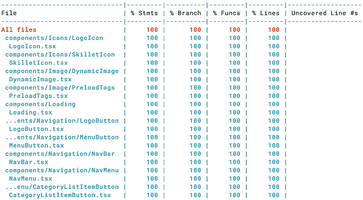

<!--  -->

---

  <a href="../README.md">TL;DR</a>&nbsp;&nbsp;|&nbsp;&nbsp;
  <a href="contentful.md">Contentful as Headless CMS</a>&nbsp;&nbsp;|&nbsp;&nbsp;
  <a href="performance.md">Maximizing Performance</a>&nbsp;&nbsp;|&nbsp;&nbsp;
  <strong>Automation</strong>&nbsp;&nbsp;|&nbsp;&nbsp;
  <a href="manual-scans.md">Manual Scans</a>&nbsp;&nbsp;|&nbsp;&nbsp;
  <a href="next-steps.md">Next Steps</a>

---

## Automation

Automation for this project is based on two technologies, npm scripts and workflows in GitHub Actions.

Package scripts are used locally for code quality checks during the local development process. These scripts are also used as pre-commit hooks by <a href="https://typicode.github.io/husky/#/" target="_blank">Husky</a> to ensure code quality before feature branches are pushed to GitHub for pull requests.

GitHub Actions perform code quality checks on any push of a feature branch to GitHub and to trigger the build and deploy process through merged pull requests or a webhook request when new content is published.

### npm Scripts

There is a collection of npm scripts in the root `package.json` file that are used for code quality checks, build, and deployment. These are run from the console in local development or as part of the workflow in GitHub actions.

#### Quality Control Scanning Scripts

- `scan` - runs typecheck, linting, and unit testing on all workspaces
- `scan:local` - runs quality control scans referencing a local `.env` file

#### Linting Scripts

- `lint` - runs style and formatting checks on all workspaces using prettier and eslint
- `lint:fix` - runs linting checks and fixes outstanding issues on all workspaces

#### GraphQL Type Generation Scripts

- `typegen` - runs TypeScript codegen based on Contentful content models and GraphQL queries and fragments for the Next.js application
- `typegen:watch` - runs type generation in watch mode for development

#### Type Check Script

- `typecheck` - runs type checking on all workspaces

#### Unit Test Scripts

- `test` - runs the suite of unit tests on all workspaces
- `test:dev` - runs unit tests in watch mode on all workspaces
- `test:snapshot"` - runs unit tests, rebuilding any updated test snapshots on all workspaces
- `test:ci` - runs unit tests in jest cli mode on all workspaces

#### Husky Hook Script

- `prepare` - installs packages to prepare Husky for local pre-commit scans

#### Deployment Scripts

- `deploy` - Deploys a branch-specific stack of AWS resources from the `cdk` workspace and a statically-rendered Next.js app from the `client` workspace
- `deploy:shared` - Deploys a shared stack of AWS resources for `prod` if in the `main` branch or for `dev` if in a feature branch

#### Local Development Scripts for the Next Workspace

- `dev` - launches the local development server
- `predev` - runs `typegen` before launching the development server
- `start` - launches the next server locally
- `prestart` - runs the `build` script before launching the local server

#### Build and Deploy Scripts for the Next Workspace

- `build` - runs a Next.js build
- `postbuild` - runs `sitemap` after the current build
- `sitemap` - generates sitemap files for the statically generated site
- `export` - exports Next.js build files to the `/out` directory
- `predeploy` - runs `build` before deployment
- `deploy` - syncs build artifacts in the `out` directory with the S3 bucket that hosts the static site
- `invalidate` - invalidates the CloudFront distribution cache
- `preexport` - runs `build` before exporting

#### Build and Deploy Scripts for the CDK Workspace

- `build` - generates a Typescript build to transpile source files
- `deploy` - deploys a branch-specific stack of AWS resources
- `deploy:shared` - deploys a shared stack of AWS resoursed for the `dev` or `prod` environment
- `destroy` - removes the AWS resources for the branch-specific stack (for use with GitHub Actions)
- `destroy:local` - removes the AWS resources for the branch-specific stack (for use in the local development environment)
- `destroy:shared` - removes the shared AWS resources for an environment

### Unit Testing

Unit testing for both workspaces uses `jest` with the addition of `testing-library` for React in the `client` workspace. Combining these two packages enables unit testing on TypeScript modules as well as user-centered testing of the React UI in cases where there are specific user actions that result in code execution.

It is possible to get complete code coverage by rendering the React components and handling conditional use cases in the code, but this does not validate the rendered output. The addition of **snapshot tests** ensures that every time the unit test is run, the output of the component's render function can be tested for consistency without explicitly checking for individual rendered elements in each test.

#### Coverage

The current unit testing suite covers 100% of the codebase in both workspaces with the exception of 4 files. The files that are specifically ignored either do not have callable functions or are boilerplate code generated by `create-next-app` that are excessively complex to mock and are generally not modified.

- `src/pages/_app.tsx` - This is the boilerplate for creating a React generated by `create-next-app`. The page is essentially a collection of nested providers specified by Next.js.

- `src/pages/_document.tsx` - This page is the boilerplate for generating Next.js pages for the application. It is the static wrapper for creating the html documents for each page.

- `lib/gqlClient.ts` - This module exports an `urql` client for making GraphQL API queries. All API functionality is tested in `src/lib/api.ts`. The `createClient()` function in this module requires mocking of a complex 3rd-party client that has a low risk of undetected changes.

- `src/lib/styles.ts` - a collection of utility styles that can be applied to various components but do not fit clearly in the Material UI theme. Since they are static representations of style classes, there is no code to execute in this file

  

### Local Automation using Husky

Using Husky and a `pre-commit` hook, code quality scans are run on both workspaces before any git commit can be executed, including **type generation, type checks, linting,** and **unit tests.**

### CI/CD automation using GitHub Actions

#### Code Quality

The GitHub Actions `scan` workflow performs **linting, checks Typescript types,** and **runs unit tests.**

`scan` is triggered by pushing a feature branch to GitHub

#### Next.js Build and Deploy

The GitHub Actions `build` workflow generates the most recent types based on current content models and runs unit tests, then executes a Next.js build. The artifacts from the build are deployed to the web by syncing with an AWS S3 bucket and invalidating the CloudFront distribution.

Once the new client is deployed, the `build` workflow also updates the **Algolia** search index with the most up-to-date content from **Contentful**.

`build` is triggered by merging the main branch through an approved pull request.

`build` is also triggered when a scheduled publish event occurs in Contentful and it posts a request to a GitHub webhook that triggers the build and deploy workflow.

#### AWS CDK Build & Deploy

There are additional GitHub actions for managing stacks of AWS resources:

`deploySharedAws` is triggered manually when a set of shared AWS resources need to be created. If run when the current git branch is `main`, a set of shared resources is created for the `prod` environment. If run against a feature branch, a set of shared resources is created for the `dev` environment.

`deployBranchAws` is triggered by a push to any feature branch or from merging a pull request to the `main` branch. If run If run when the current git branch is `main`, a set of branch-specific AWS resources are created for the `prod` environment. If run against a feature branch, a set of branch-specific resources are created for the feature branch using shared resources from the `dev` environment

Using a single CDK application for deploying AWS resources enables just-in-time creation of feature branch environments for testing that are identical to production environments and enables reliable migration of code across environments without introducing enviroment-specific variations.

---

  <a href="../README.md">TL;DR</a>&nbsp;&nbsp;|&nbsp;&nbsp;
  <a href="contentful.md">Contentful as Headless CMS</a>&nbsp;&nbsp;|&nbsp;&nbsp;
  <a href="performance.md">Maximizing Performance</a>&nbsp;&nbsp;|&nbsp;&nbsp;
  <strong>Automation</strong>&nbsp;&nbsp;|&nbsp;&nbsp;
  <a href="manual-scans.md">Manual Scans</a>&nbsp;&nbsp;|&nbsp;&nbsp;
  <a href="next-steps.md">Next Steps</a>

---
