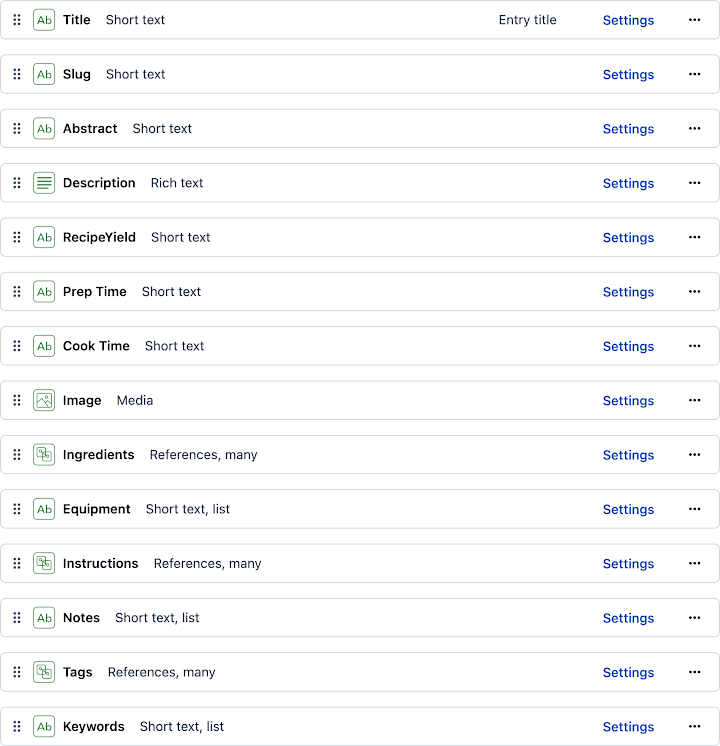

## Contentful as Headless CMS

This application uses Contentful as its headless content management system. Contentful provides two APIs that are used in the prjoect:

- The **content API** provides a GraphQL endpoint for content queries. This api is also used to retrieve content models from the CMS for code generation of TypeScript types used in the client-side codebase.

- The **images API** provides a REST endpoint for retrieving image assets by the client application. This api can also apply transformations to the image assets through url parameters. Requests for images are cached for individual image sizes and formats, reducing calls to the origin server and improving overall client performance.

### Code Generation for GraphQL Types

In order to define the TypeScript types for content payloads returned by GraphQL queries to Contentful, the application uses <a href="https://the-guild.dev/graphql/codegen" target="_blank">GraphQL Code Generator</a>.

Defintions for entire payloads are defined by named GraphQL queries in the code, while sections of the payload that are passed as properties to individual React components are defined by GraphQL fragments referenced by the queries.

### Content Definitions

There are two key content types in the system:

- `Recipe` - This is the primary content type that defines the page-level content for the application. A Recipe entry contains all data and metadata that is required to render a full page of Recipe content. Client side queries can also retrieve summary versions of a Recipe entry for display in the card format.

  

- `Tag` - Tags are simply labels applied to content that are used to organize and query for collections of content. All queries and grouping of content on the client are organized around tags.

  

Additionally, there is one other content type in the system:

- `Taxonomy` - A Taxonomy is a collection of tags. The Taxonomy is used to generate custom grouped collections of Recipe content. A Taxonomy can also be used as the child of a parent taxonomy to define sub-groups within the parent taxonomy.

  

In this application, for example, the primary navigation menu is built from a Taxonomy called `Categories`. Categories are a list of editorially selected tags that are shown in the navigation menu and also generate Category pages containing all Recipes that are assigned the category tag. Child taxonomies are used to create subcategories under category tags.

Since the only difference between a category and a tag page is that certain tags have been editorially selected to appear in the navigation, the application renders the page as a "tag" page.

Next.js routing is configured to rewrite requests to a `/category/*` url to the identical `/tag/*` page with appropriate canonical page tags.

---

  <a href="../README.md">TL;DR</a>&nbsp;&nbsp;|&nbsp;&nbsp;<strong>Contentful as Headless CMS</strong>&nbsp;&nbsp;|&nbsp;&nbsp;<a href="performance.md">Maximizing Performance</a>&nbsp;&nbsp;|&nbsp;&nbsp;<a href="automation.md">Automation</a>&nbsp;&nbsp;|&nbsp;&nbsp;<a href="manual-scans.md">Manual Scans</a>&nbsp;&nbsp;|&nbsp;&nbsp;<a href="next-steps.md">Next Steps</a>

