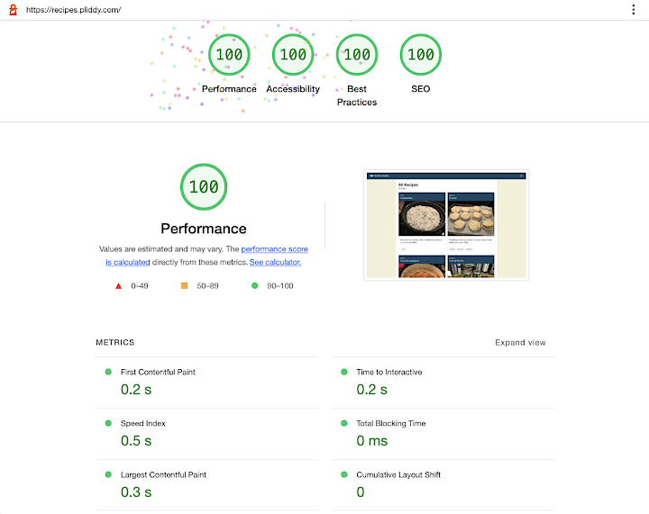
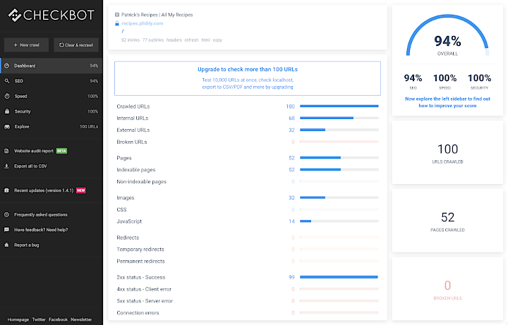
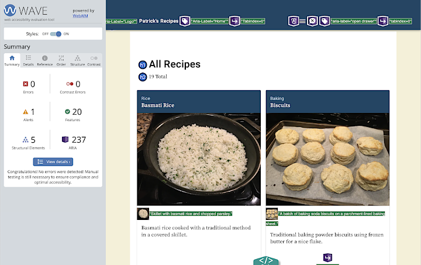

## Manual Scans

In addition to the automated code quality checks in the CI/CD pipeline, **manual scans** are executed on major deployments to identify any issues and resolve them early. This early intervention eliminates potential impacts to performance, security, SEO, and accessibility before they are implemented at scale and become long-running technical debt.

### Google Lighthouse

The application is manually checked for **performance, accessibility, best practices,** and **SEO** using the Lighthouse in the Google Chrome developer tools.

Lightouse scores for **Best Practices, SEO,** and **Accessibility** are 100.

**Performance** scores are regularly in the high 90's, often achieving a perfect 100 if assets are cached on the CDN.

  

### Checkbot Site Scanner

In order to get more detailed technical scans for **SEO, security,** and **performance,** the application is scanned with the <a href="https://chrome.google.com/webstore/detail/checkbot-seo-web-speed-se/dagohlmlhagincbfilmkadjgmdnkjinl" target="_blank">Checkbot Site Scanner</a> Chrome Browser extension.

Checkbot identified a variety of potential security issues with the configuration of the static site delivery through AWS CloudFront and S3. Any potential security issues were addressed by proper configuration of response header tags in CloudFront.

#### Current issues identified by Checkbot

The single SEO-related technical issue identified by Checkbot is the lack of a properly re-directing 404 page. This feature is part of the next round of user stories in the backlog.

The remaining issues that impact the application's potential SEO score are related to the relatively thin content currently in the system. There are a limited number of recipes with placeholder content for descriptions and abstracts on core content pages.

These issues will be addressed by updating all current recipe descriptions and abstracts with more robust copy and the creation of additional recipes to ensure that pages that display collections of recipes by tag are unique. With the limited number of recipes currently in the system, there can be multiple tag pages that display the same single recipe. To bots crawling the site, these pages have duplicate content.

  

### WAVE Evaluation Tool

In order to get more detailed information regarding **site accessibility,** the application is scanned with the <a href="https://chrome.google.com/webstore/detail/wave-evaluation-tool/jbbplnpkjmmeebjpijfedlgcdilocofh" target="_blank">WAVE Evaluation Tool</a> Chrome Browser extension.

While Lighthouse identifies major accessibility issues with a page, WAVE conducts a more detailed scans and identifies specific WCAG issues which can affect a page's accessibility.

#### Current issues identified by WAVE

The only outstanding warning from WAVE is the existence of a `<noscript>` tag on the page, which is inserted by Next.js as part of the build process.

  

<!-- 

    

        <&nbsp;<a href="automation.md">Automation</a>
    

    

        <a href="next-steps.md">Next Steps</a>&nbsp;>
    

 -->

---

  <a href="../README.md">TL;DR</a>&nbsp;&nbsp;|&nbsp;&nbsp;<a href="docs/contentful.md">Contentful as Headless CMS</a>&nbsp;&nbsp;|&nbsp;&nbsp;<a href="performance.md">Performance</a>&nbsp;&nbsp;|&nbsp;&nbsp;<a href="automation.md">Automation</a>&nbsp;&nbsp;|&nbsp;&nbsp;<strong>Manual Scans</strong>&nbsp;&nbsp;|&nbsp;&nbsp;<a href="next-steps.md">Next Steps</a>

---
