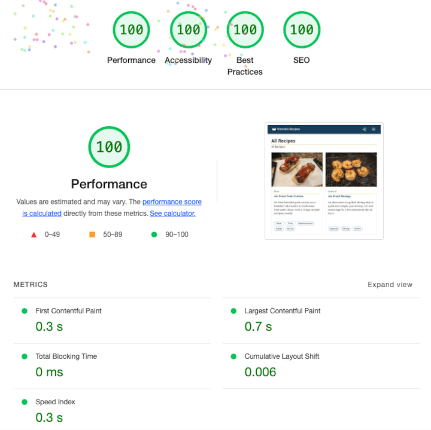

<!--  -->

---

  <a href="../README.md">TL;DR</a>&nbsp;&nbsp;|&nbsp;&nbsp;
  <a href="contentful.md">Contentful as Headless CMS</a>&nbsp;&nbsp;|&nbsp;&nbsp;
  <a href="performance.md">Maximizing Performance</a>&nbsp;&nbsp;|&nbsp;&nbsp;
  <a href="automation.md">Automation</a>&nbsp;&nbsp;|&nbsp;&nbsp;
  <strong>Manual Scans</strong>&nbsp;&nbsp;|&nbsp;&nbsp;
  <a href="next-steps.md">Next Steps</a>

---

## Manual Scans

In addition to the automated code quality checks in the CI/CD pipeline, **manual scans** are executed on major deployments to identify any issues and resolve them early. This early intervention eliminates potential impacts to performance, security, SEO, and accessibility before they are implemented at scale and become long-running technical debt.

### Google Lighthouse

The application is manually checked for **performance, accessibility, best practices,** and **SEO** using the Lighthouse in the Google Chrome developer tools.

Lightouse scores for **Best Practices, SEO,** and **Accessibility** are 100.

**Performance** scores are regularly in the high 90's, often achieving a perfect 100 if assets are cached on the CDN.

  

### Checkbot Site Scanner

In order to get more detailed technical scans for **SEO, security,** and **performance,** the application is scanned with the <a href="https://chrome.google.com/webstore/detail/checkbot-seo-web-speed-se/dagohlmlhagincbfilmkadjgmdnkjinl" target="_blank">Checkbot Site Scanner</a> Chrome Browser extension.

Checkbot identified a variety of potential security issues with the configuration of the static site delivery through AWS CloudFront and S3. Any potential security issues were addressed by proper configuration of response header tags in CloudFront.

#### Current issues identified by Checkbot

The remaining issues that impact the application's potential SEO score are related to the relatively thin content currently in the system. There are a limited number of recipes with placeholder content for descriptions on core content pages.

These issues will be addressed by updating all current recipe descriptions with more robust copy and the creation of additional recipes allow for more robust tagging. With the limited number of recipes currently in the system, tags are only applied to recipes if they would result in a unique collection page.

  

### WAVE Evaluation Tool

In order to get more detailed information regarding **site accessibility,** the application is scanned with the <a href="https://chrome.google.com/webstore/detail/wave-evaluation-tool/jbbplnpkjmmeebjpijfedlgcdilocofh" target="_blank">WAVE Evaluation Tool</a> Chrome Browser extension.

While Lighthouse identifies major accessibility issues with a page, WAVE conducts a more detailed scans and identifies specific WCAG issues which can affect a page's accessibility.

#### Current issues identified by WAVE

The only outstanding warning from WAVE is the existence of a `<noscript>` tag on the page, which is inserted by Next.js as part of the build process.

  

### Google Rich Results Test

In order to validate the structure of page schema for recipes and collection pages, pages of each type are manually checked using Google's <a href="https://https://search.google.com/test/rich-results" target="_blank">Rich Results Tool</a>. This scan checks the `ld+json` schema specified in the page head and confirms that the content data is correctly structured to populate Google's Rich Search Results for recipe content.

#### Current issues identified by Google Rich Results Test

All recipe and collection page types have the full set required schemas for Rich Search Results, as well as most optional data. The only optional data fields that are not present are calorie totals, videos, and ratings. None of these items of content are currently part of the application.

  

---

  <a href="../README.md">TL;DR</a>&nbsp;&nbsp;|&nbsp;&nbsp;
  <a href="contentful.md">Contentful as Headless CMS</a>&nbsp;&nbsp;|&nbsp;&nbsp;
  <a href="performance.md">Maximizing Performance</a>&nbsp;&nbsp;|&nbsp;&nbsp;
  <a href="automation.md">Automation</a>&nbsp;&nbsp;|&nbsp;&nbsp;
  <strong>Manual Scans</strong>&nbsp;&nbsp;|&nbsp;&nbsp;
  <a href="next-steps.md">Next Steps</a>

---
